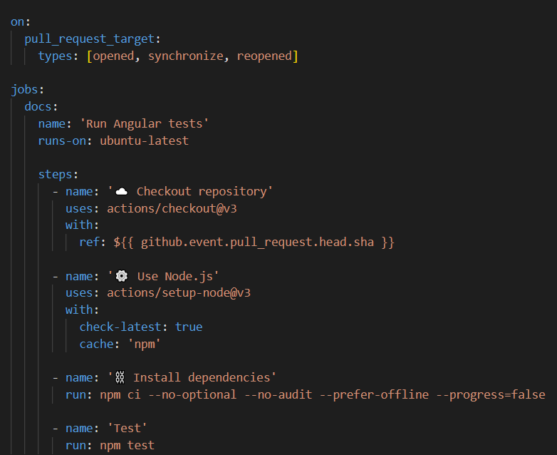

# Github Actions Tutorial

Dieses Projekt wurde erstellt, um dir das Thema GitHub Actions ein bisschen näherzubringen.
Du wirst lernen GitHub Actions aufzusetzen und zu benutzen.
Zunächst wirst du das Repository forken und Schritt für Schritt eine CI/CD Pipeline aufbauen.

## Was ist GitHub Actions
GitHub Actions ist ein `CI/CD-Tool für den GitHub-Flow`. GitHub Actions bietet leistungsstarke Automatisierungs- und CI/CD-Funktionen direkt neben dem Code in GitHub.

### Die Vorteile von GitHub Actions
* Actions bietet die Möglichkeit, die Automatisierungen direkt in den Repositories zu implementieren. 
* Actions bietet gehostete virtuelle Maschinen (VM) mit `Ubuntu Linux, Windows und macOS`, damit der Code direkt auf dem Betriebssystem Ihrer Wahl erstellt, getestet und deployt werden kann.
* Vorgefertigte [CI-Templates](https://github.com/actions), die sofort einsatzbereit sind.
* GitHub Actions kann kostenlos für alle öffentlichen Repositories genutzt werden. Für private Repositories ist die Nutzung mit einem Limit von 2.000 Minuten pro Monat für gehostete Workflows kostenlos möglich.
  (Für Organisationen weichen die Limits ggf. ab)
* Mit wenig Zeilen Code Repositories automatisieren.

### Atos zielt darauf ab, GitHub Actions vermehrt als CI/CD-Tool zu nutzen.

## Technologies und Ziel dieses Tutorials
Dies ist ein einfaches Angular 14 Projekt, welches aktuell keine Backendverbindung aufbaut.
Das Ziel ist es das Projekt zu testen, zu bauen und schlussendlich auf GitHub Pages zu deployen.
Dort wird es dir möglich sein diese Webapplikation zu sehen und zu nutzen.

## Next step (Fork the repository)
[Continue with the Tutorial](tutorial/fork-the-repository.md) (Das folgende Tutorial ist auf Englisch.)
