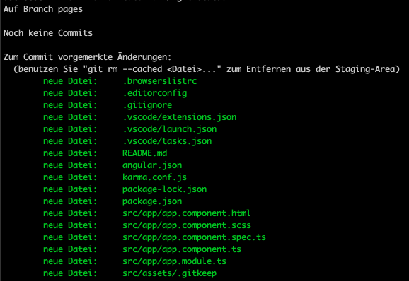
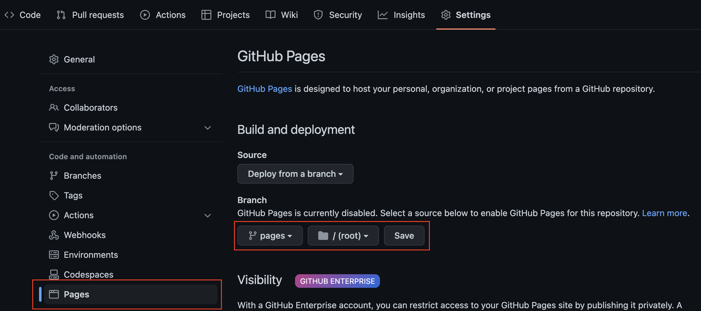
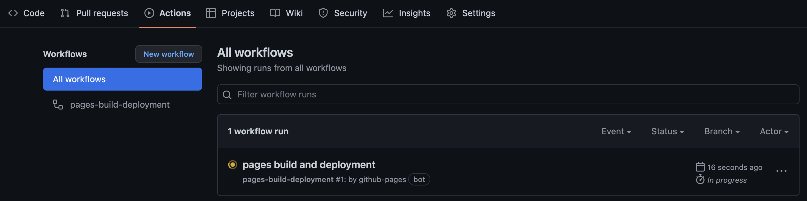
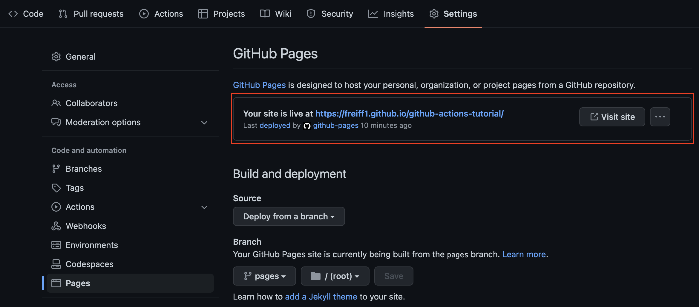

# Deployment to GitHub Pages
Goal of this chapter is to build the angular application and deploy it to GitHub pages.
For this you are going to set up a deployment branch and create a new workflow.

## Preparations
For being able to deploy the angular application to GitHub pages, you need to do some preparations first.

### Creating an orphan branch
GitHub pages can be activated to deploy the content of a specific branch.
This branch should contain the executable application and not the source code.
To do so, you need a branch without git history of the other branches. This is called orphan branch.
It can be created with the following command:  
`git checkout --orphan pages`  
It will create an orphan branch named `pages`.

#### Remove the contents of the orphan branch
If you run `git status`, you will see a lot of staged files.  

  

As you don't want to have any code on this branch, you need to remove all these files.
The only thing that should be left, is the `.git` directory.

#### Create index.html
Now create a file called `index.html` with a simple content like the following:
```html
<!DOCTYPE html>
<html>
    <head>
        <title>Hello GitHub pages</title>
    </head>
    <body>
        <p>You successfully deployed this page to GitHub Pages.</p>
    </body>
</html>
```
#### Commit and push index.html
Commit your `index.html` and push it using `git push --set-upstream origin pages`.

### Enable GitHub pages deployment
Go to your repository &rarr; Settings &rarr; Pages &rarr; Build and deployment. 
You will be able to select a branch, which will be deployed to GitHub pages.  

  

As you click `Save`, an Action will start the deployment.

### Check your deployment
Go to your repository &rarr; Actions.
You should be able to see a running action named `pages build and deployment`.  



## View the deployed page
To get the link of your deployed page,
visit your repository &rarr; Settings &rarr; Pages &rarr; `Your site is live at [...]`.
Click the link to open your deployed page.  




## Next step (Deployment to GitHub pages)
[Continue with the tutorial](deployment-workflow.md)
