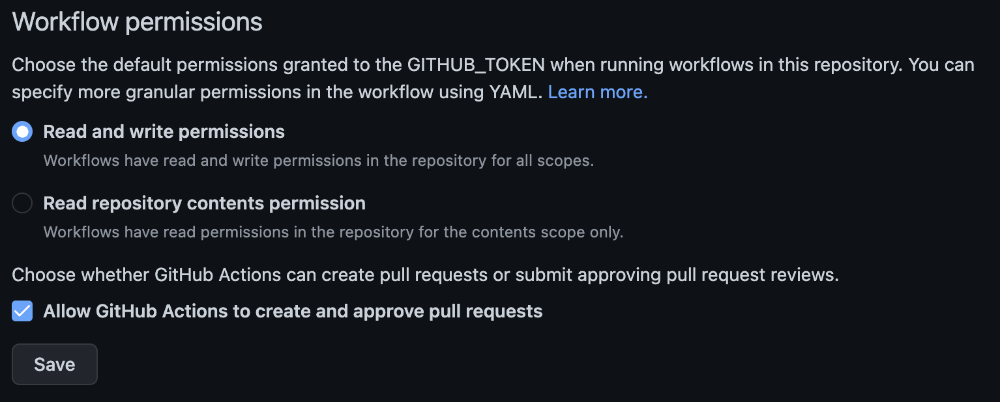

# Deployment workflow
In this chapter you will learn how to build and automatically deploy your Angular application.

## Steps of the workflow
For building your angular application and deploy it to GitHub pages, you need to follow these steps:
1. Define an event (on push to master)
2. Setting up a token
3. Run a container
4. Checkout the code
5. Install Node.js
6. Install dependencies
7. Build the application
8. Copy dist directory to `pages` branch

## Create the workflow
Create a file named `deploy-on-push-to-master.yml`.

## Define an event
For your workflow you need to define an event which triggers the deployment.
In this case a push to the `main` branch can be useful. Use the following code:
```yml
name: Deploy

on:
  push:
    branches:
      - 'main'
```

## Setting up a token
To enable the workflow to commit your built application to the `pages` branch, it needs the permissions to do so.

### GITHUB_TOKEN
For this you can use an automatically generated token called `GITHUB_TOKEN`.
To check the permissions go to your repository &rarr; Settings &rarr; Actions &rarr; General &rarr; Workflow permissions  

  

The permissions should be set to `Read and write permissions`

### Workflow secrets
You can add the `GITHUB_TOKEN` as workflow secret. Use the following code:  

```yml
  workflow_call:
    secrets:
      GITHUB_TOKEN:
        required: true
```

## Run a container / Checkout the code / Install Node.js / Install dependencies
These steps are the same, as in [running-tests workflow.](deployment-to-github-pages.md)


## Build 
Create a build directory with a `Production build` of your project.

```yml
    - name: '🛠️ Build'
      run: npm run build --prod
```


## Install rsync
Synchronizes files and directories between local machine and host.

```yml
    - name: '📚 Install rsync'
      run: sudo apt-get update && sudo apt-get install -y rsync
```


## Deploy to pages
Following piece of code deployes the build to Github pages, using "JamesIves/github-pages-deploy-action@v4", a pre-defined github page deploy action.([Here](https://github.com/actions) is the reference to the available predefined actions from GitHub).  

Once the file is built, it will copy the `dist/github-actions-tutorial/` folder to the Github pages.  


```yml
    - name: '🚀 Deploy to pages'
      uses: JamesIves/github-pages-deploy-action@v4
      with:
        branch: pages # The branch the action should deploy to.
        folder: dist/github-actions-tutorial/ # The folder the action should deploy.
        target-folder: ./
        token: ${{ secrets.GITHUB_TOKEN }}
```

 
## The workflow
```yml
name: Deploy

on:
  push:
    branches:
      - 'main'

  workflow_call:
    secrets:
      GITHUB_TOKEN:
        required: true
jobs:
  docs:
    name: '🌍 Deploy'
    runs-on: ubuntu-latest

    steps:
      - name: '☁️ Checkout repository'
        uses: actions/checkout@v3

      - name: '⚙️ Use Node.js'
        uses: actions/setup-node@v3
        with:
          check-latest: true
          cache: 'npm'

      - name: '⛓️ Install dependencies'
        run: npm ci --no-optional --no-audit --prefer-offline --progress=false

      - name: '🛠️ Build'
        run: npm run build --prod

      - name: '📚 Install rsync'
        run: sudo apt-get update && sudo apt-get install -y rsync

      - name: '🚀 Deploy to pages'
        uses: JamesIves/github-pages-deploy-action@v4
        with:
          branch: pages # The branch the action should deploy to.
          folder: dist/github-actions-tutorial/ # The folder the action should deploy.
          target-folder: ./
          token: ${{ secrets.GITHUB_TOKEN }}
```

This is the whole Angular application deployment process. Best wishes with your deployment.
