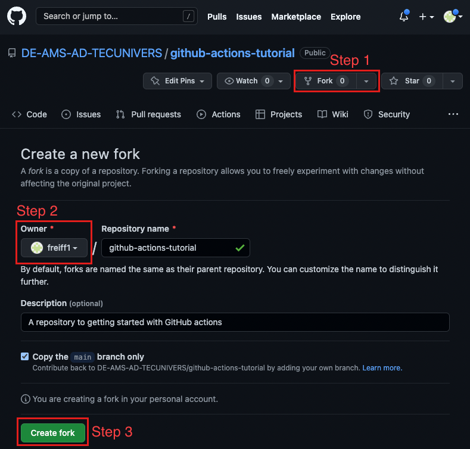

## How to start?
The first step is to fork this repository to your own account.
It needs to be a public repository, so you will be able to use all features (including GitHub pages) for free.
For Atos organisations, you will also be able to use GitHub pages for private repositories.

1. Click the fork button, you will be forwarded to the page below
2. Select the owner of the new repository (you are also able to change the name)
3. Create fork

## Next step (Setting up GitHub actions)
[Continue with the Tutorial](setting-up-github-actions.md)
