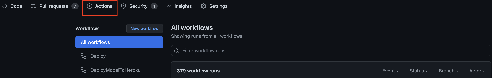

# Running tests inside GitHub actions
Goal of this chapter is to run the angular tests when a pull request is created or updated.
For this we are going to create a new workflow.

## Steps of the workflow
For running angular tests inside the workflow, we need to follow these steps:
1. Run a container
2. Checkout the code
3. Install Node.js
4. Install dependencies
5. Run the tests

## Create the workflow
Create a file named `test-on-pullrequest.yml`.

## Run a container
Add the following code to your `test-on-pullrequest.yml`.
It will run the workflow on (re-)opening and synchronizing a pull request.
It will then create a job called `Run Angular tests` running inside an ubuntu container.
```yml
on:
  pull_request_target:
    types: [opened, synchronize, reopened]

jobs:
  docs:
    name: 'Run Angular tests'
    runs-on: ubuntu-latest
```

## Checkout the code
To checkout the repository we use the action `actions/checkout@v3` ([Find the repository on GitHub](https://github.com/actions/checkout)).
It uses a parameter `with` to define which commit should be checked out.
`${{ github.event.pull_request.head.sha }}` gets the head of the current pull request.
```yml
    steps:
      - name: '☁️ Checkout repository'
        uses: actions/checkout@v3
        with:
          ref: ${{ github.event.pull_request.head.sha }}
```

## Install Node.js
By using `actions/setup-node@v3` ([Find the repository on GitHub](https://github.com/actions/setup-node)),
we can easily set up Node.js, so we will be able to run Angular tests.
```yml
      - name: '⚙️ Use Node.js'
        uses: actions/setup-node@v3
        with:
          check-latest: true
          cache: 'npm'
```

## Install dependencies
It is also possible to run custom code for example `npm install`.
By adding the following we will be able to install dependencies.
```yml
      - name: '⛓️ Install dependencies'
        run: npm ci --no-optional --no-audit --prefer-offline --progress=false
```

## Run the tests
To run the tests we need to call `npm test`. We will also do this by defining a new step with the `run` property.
```yml
      - name: 'Test'
        run: npm test
```

## Trigger the workflow
To trigger the workflow we now need to create a new pull request.
To do so, create a new branch, do some changes and push it. Now create a pull request.
This should start a new build which you can find in the tab `Actions`.


## Next step (Deployment to GitHub pages)
[Continue with the tutorial](deployment-to-github-pages.md)
