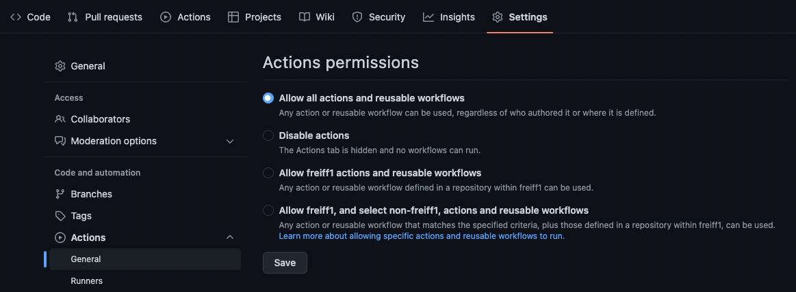

# Setting up GitHub actions

## Enable GitHub Actions
GitHub actions are enabled by default. To check your repositories settings:  
Go to repository &rarr; Settings &rarr; Actions &rarr; General  
The default setting should be "Allow all actions and reusable workflows"  

## Create the workflow directory structure
GitHub actions is working with `.yml` files, which define pipelines (workflows), steps and conditions.
These `.yml` files will be placed in the folder `/.github/workflows/`  
First step is to create this folder.

## Next step (Structure of Workflows)
[Continue with the tutorial](structure-of-workflows.md)
